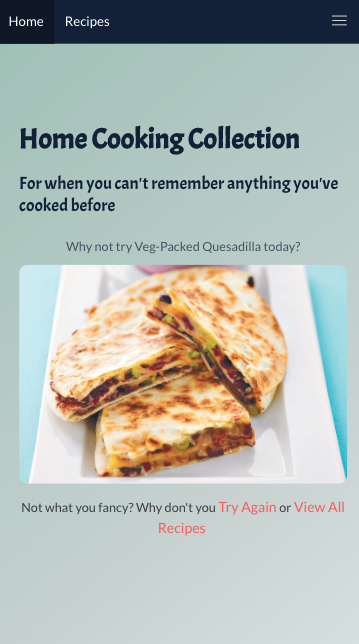
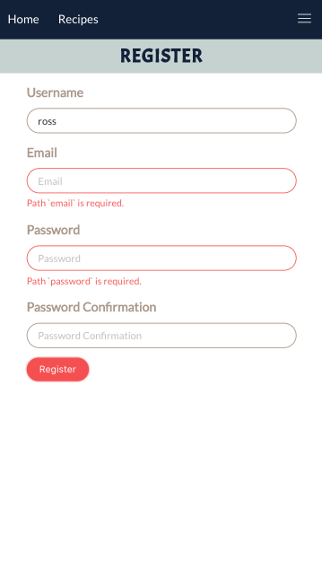
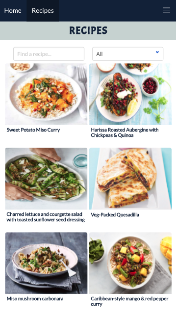
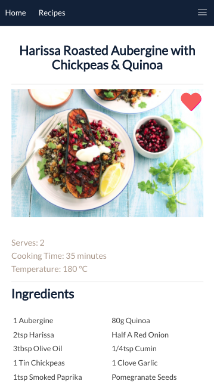
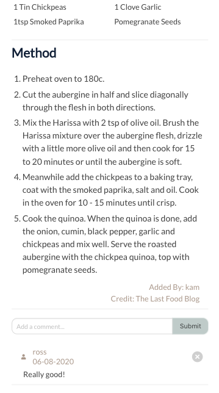
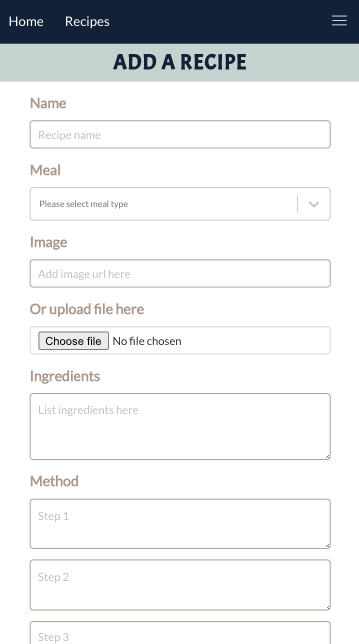

# RECIPE BOOK

This app has been built to enable you to store all your everyday recipes in one place so you never have to struggle to think of what to cook for dinner again. An online 'recipe share' you can view recipes uploaded by all users aswell as upload your own. 

Please see hosted version here: [Recipe Book](https://everydayrecipebook.herokuapp.com/)

If you want to view the app directly from your home screen:
* On iOS mobile: visit the link above, tap the share button and 'Add to Home Screen'
* On Mac: Click the '+' sybmbol on the right side of the URL bar
* On Android: Hit the menu button in the upper right corner (3 vertical dots) and tap'Add to Home Screen'

### Technologies Used
* MongoDB
* Mongoose
* Express
* Node.js
* React
* Axios
* NPM
* Bulma
* Cloudinary

### Screenshot Walk-through

1. Home Page

2. Register Page - users can view all recipes without being logged in, but in order to upload a recipe or comment on other recipes you must be logged in

2. Login Page 

3. Recipe Index Page - users can search for a recipe based on name or ingredients and filter by meal

4. Recipe Show Page - if users are logged in they can add favourite recipes by clicking the heart and add comments/reviews to recipes

5. Add a Recipe - users can either add a url to a picture of the recipe or they can upload their own image which is stored on cloudinary.

6. Created Recipes Page - users can view all the recipes they have uploaded from this page and either edit or delete the recipe from here

7. Favourite Recipes Page - users favourites are stored in one place, removed by clicking the cross in the top right corner of each recipe

6. Edit Recipe Page

### Functionality 
Users can do the following:
* Register & Login
* Post, edit, delete recipes
* Add comments to recipes
* Add and remove recipes from their favourites
* The app can be used either within the browser or as a progressive web app

### Future Features 

Additional features I would like to include are
* Weekly recipe diary & shopping list 
